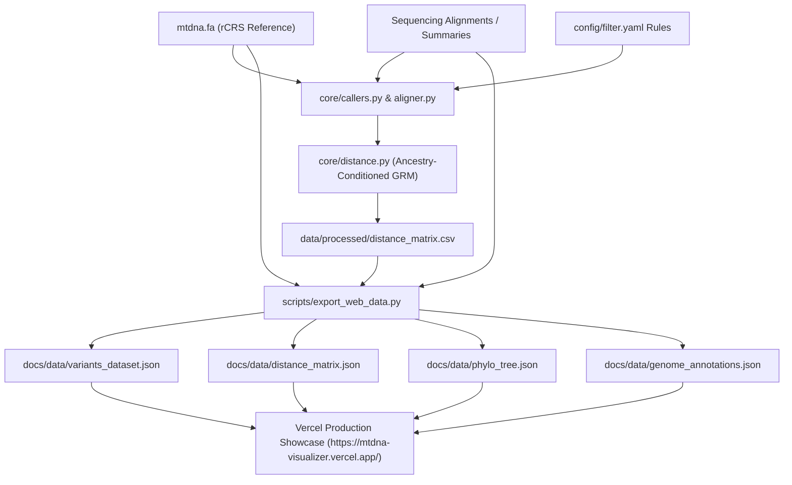

# Genomic Mito Showcase

Production-grade mitochondrial DNA (mtDNA) variant calling, gap alignment standardization, ancestry-conditioned GRM weighted distance matrix calculation, and interactive web showcase deployed on **Vercel**.

[](https://mtdna-visualizer.vercel.app/)
[](https://vercel.com/new/clone?repository-url=https%3A%2F%2Fgithub.com%2Fnbasok149%2Fgenomic-mito-showcase)


🌐 **Active Production Website**: [https://mtdna-visualizer.vercel.app/](https://mtdna-visualizer.vercel.app/)

---

## Executive Summary & System Architecture

This repository models human mitochondrial DNA (mtDNA) sequencing analysis against the revised Cambridge Reference Sequence (rCRS NC_012920.1, 16,569 bp).

It implements:
- **Gap Alignment Standardization**: Deterministic 3'/5' coordinate gap shifting (`align_gaps_to_lower_coordinate`) on forward (+) and reverse (-) strand sequencing reads.
- **Variant Quality Control**: High VAF thresholding (&ge; 10%), strand bias filtering (&lt; 0.80 ratio), homopolymer run identification (&ge; 5 bp), and clonal amplification detection.
- **Ancestry-Conditioned GRM Weighted Distance Matrix**: Rare-variant weighted genetic relationship score \(K(i, j) = \frac{1}{V}\sum \frac{(VAF_{i,v}-p_v)(VAF_{j,v}-p_v)}{p_v(1-p_v)}\), haplogroup shrinkage (\(\hat{p}_v^{(g)} = \lambda p_v^{(g)} + (1-\lambda)p_v^{\text{global}}\)), and exact metric conversion \(D(i, j) = \max(K) - K(i, j)\).
- **Zero-Dependency Web Showcase**: Modern, client-side web application built with HTML5, Tailwind CSS, Vanilla JS, and D3.js deployed on **Vercel** with global Anycast Edge distribution at **[https://mtdna-visualizer.vercel.app/](https://mtdna-visualizer.vercel.app/)**.



---

## Directory Structure

```
genomic-mito-showcase/
├── vercel.json                     # Vercel deployment, edge routing & cache headers
├── package.json                    # NPM build & test scripts for Vercel builder
├── core/                           # Modular Python genomic analysis engine
│   ├── __init__.py
│   ├── aligner.py                  # Gap coordinate standardization algorithm
│   ├── callers.py                  # Variant calling engine & filter enforcement
│   ├── distance.py                 # Multi-sample ancestry-conditioned GRM distance calculator
│   ├── validator.py                # Locus search & reference sequence validator
│   └── comparator.py               # Two-sample variant differential comparator
├── config/
│   └── filter.yaml                 # QC parameters and filtering rules
├── data/
│   ├── reference/
│   │   └── mtdna.fa                # Human Mitochondrial Reference Genome (rCRS, 16,569 bp)
│   ├── raw_summaries/              # Sample VAF summaries
│   └── processed/
│       ├── distance_matrix.csv     # 45x45 pairwise distance matrix (V=282 polymorphic loci)
│       └── phylogenetic_tree.jpg   # Baseline tree rendering
├── scripts/
│   ├── export_web_data.py          # Data ETL script serializing CSVs to web JSON
│   ├── run_pipeline.py             # CLI entrypoint for variant calling pipeline
│   └── compare_samples.py          # CLI tool for sample pair comparison
├── tests/
│   └── test_distance.py            # Unit tests for weighted distance metric & UPGMA tree
├── docs/                           # Vercel Web Showcase Root (served by vercel.app)
│   ├── index.html                  # Single-page application UI
│   ├── css/
│   │   └── styles.css              # Custom styling & glassmorphism theme
│   ├── js/
│   │   ├── app.js                  # Application controller & navigation
│   │   ├── tree_viewer.js          # D3.js SVG phylogenetic tree renderer
│   │   └── globe_viewer.js         # Three.js 3D migration globe visualizer
│   └── data/                       # Pre-processed JSON datasets
│       ├── variants_dataset.json
│       ├── distance_matrix.json
│       ├── phylo_tree.json
│       ├── world_geojson.json
│       ├── migration_routes.json
│       └── genome_annotations.json
├── LICENSE
├── README.md
└── requirements.txt
```

---

## Quick Start & Execution Guide

### 1. Run Data Pre-processing ETL
To generate or refresh the web JSON datasets in `docs/data/`:
```bash
python3 scripts/export_web_data.py
```

### 2. Run Local Variant Calling Pipeline
```bash
python3 scripts/run_pipeline.py --config config/filter.yaml --lambda-param 0.50
```

### 3. Run Automated Unit Tests
```bash
python3 -m unittest discover tests
```

### 4. Serve Web Showcase Locally
To preview the web application locally:
```bash
npm start
# or: python3 -m http.server 3000 --directory docs
```
Open `http://localhost:3000` in your web browser.

---

## Vercel Deployment & Continuous Delivery

The live showcase is hosted on **Vercel** at:
👉 **[https://mtdna-visualizer.vercel.app/](https://mtdna-visualizer.vercel.app/)**

### Automated Git Continuous Deployment:
1. Every `git push` to `main` automatically triggers Vercel's build pipeline.
2. Vercel executes `npm run build` (`python3 scripts/export_web_data.py`) to refresh all genomic matrix datasets.
3. The static output in `docs/` is deployed to Vercel's global Anycast Edge Network with 24-hour cache headers and clean URLs configured in `vercel.json`.

---

## License

Distributed under the MIT License.
