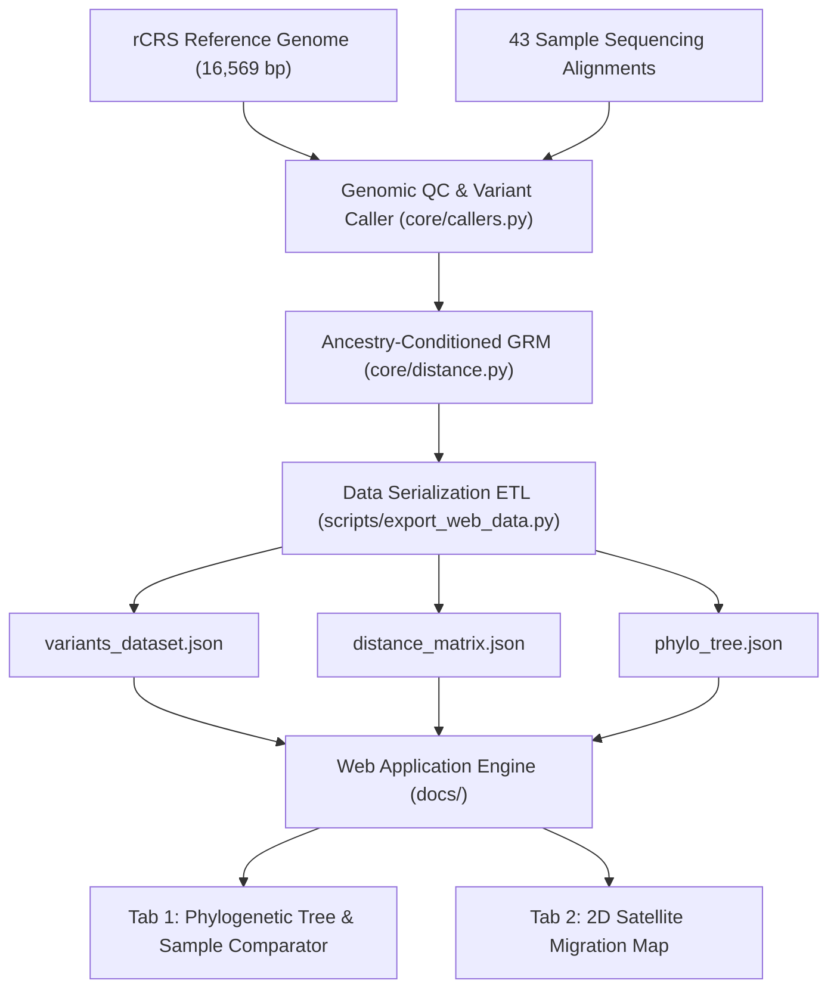

# mtDNA Variant Visualizer

**Human Mitochondrial DNA (mtDNA) Ancestral Lineage Visualizer & Phylogenetic Engine**

[](https://variant-viz.vercel.app/)
[](https://vercel.com/new/clone?repository-url=https%3A%2F%2Fgithub.com%2Fnbasok149%2Fgenomic-mito-showcase)
[](https://github.com/nbasok149/genomic-mito-showcase)
[](https://variant-viz.vercel.app/)
[](LICENSE)

**Production Application**: [https://variant-viz.vercel.app/](https://variant-viz.vercel.app/) | [https://variantvisualizer.vercel.app/](https://variantvisualizer.vercel.app/)

---

## Project Overview & Scientific Context

**Genomic Mito Showcase** is a specialized genomic visualization and lineage tracing platform built to analyze human mitochondrial DNA (mtDNA) against the revised Cambridge Reference Sequence (**rCRS NC_012920.1, 16,569 base pairs**).

Mitochondrial DNA is uniquely suited for reconstructing maternal genealogies and deep prehistoric migrations because it is **100% strictly maternally inherited without paternal crossing-over or recombination shuffling**. This platform investigates **43 sequenced whole-mitochondrial genomes across 13 global ancestral cohorts**, demonstrating maternal kinship fidelity and tracking the 200,000-year Out-of-Africa human dispersal.



---

## Key Platform Features

### 1. Tab 1: Phylogenetic Tree & Cladogram
- **Stretched Phylogram Architecture**: A 2200px horizontal layout that resolves horizontal compression while preserving smooth panning and zooming.
- **Dynamic Hierarchy Visibility**: Leaf role labels (Mother, Father, Child, etc.) are hidden in the global overview to prevent visual clutter, allowing prominent ethnicity overlay banners to identify sample clusters first. Role labels fade in smoothly upon zooming.
- **Double-Click Background Zoom-Out**: Double-clicking anywhere on the tree canvas smoothly zooms out from Family View to Macro-Branch View to Global Overview.
- **Interactive Sample Selection**: Clicking an individual sample highlights it in green (`#10b981`) without deselecting the branch, prompting the user to select a second sample for direct comparison.
- **Sample Pairwise Comparison Report**:
  - Computes exact genetic distance between individuals.
  - **Maternal Inheritance Concordance**: Explains 100% maternal identical transmission (0.00 distance for mother/child) versus independent paternal divergence for fathers.
  - **Interactive 2-Way & 3-Way Venn Diagrams**: Clickable variant dots showing shared conserved mutations and unique polymorphisms with gene annotations and variant allele frequencies (VAF).

### 2. Tab 2: 2D Prehistoric Satellite Migration Map
- **Majority-Minority Split Layout**: Features an interactive **2D high-resolution satellite basemap** (Leaflet + Esri World Imagery) paired with an un-condensed **Anthropological Evidence Dossier**.
- **Origin-First Step Progression**: Initiates at **Step 1: East African Cradle (Origin of All Modern Humans)** with step navigation controls (Next Step, Previous, Auto-Play Trail).
- **Verified Anthropological Statistics**: Every stop on the migration path includes regional media cards, evolutionary significance, and **verified archaeological and genetic statistics backed by 2+ peer-reviewed sources**:
  - *East African Cradle*: 233,000 +/- 22,000 YBP Omo Kibish fossil antiquity (Vidal et al. Nature 2022; McDougall et al. Nature 2005).
  - *Southern Coastal Gateway*: -120m sea level drop narrowing the Red Sea to 4-11 km during MIS 4 glaciations (Siddall et al. Nature 2003; Bailey et al. Quat. Int. 2007).
  - *Indian Subcontinent*: >50,000 YBP continuous tool traditions across the Toba ash layer (Petraglia et al. Science 2007; Clarkson et al. Science 2020).
  - *Beringia & Americas*: ~21,000-23,000 YBP White Sands human footprints (Bennett et al. Science 2021; Pigati et al. Science 2023).
  - *Tibetan Plateau*: `m.3394 T>C` Complex I hypoxia adaptation (Ji et al. PNAS 2012; Lu et al. Science 2016).

### 3. Opening Welcome & Genomic Education Modal
- **Mitochondrial Anatomy Graphic**: An inline vector diagram illustrating the outer membrane, folded inner cristae, and circular mtDNA loop (16,569 bp).
- **Country Flag Overlays**: Distinct country flag badges across all 13 family cohorts.
- **mtDNA vs. Nuclear DNA Comparative Matrix**:
  - *Cell Location*: Cytoplasm / Mitochondria (100-10,000 copies/cell) vs. Nucleus (2 copies/cell).
  - *Genome Size*: 16,569 bp (compact circular) vs. ~3.2 billion bp (23 chromosome pairs).
  - *Inheritance*: 100% strict maternal (unbroken molecular clock) vs. 50/50 parental recombination.

### 4. Adaptable Kinship & Gender Role Parser
- Accurately distinguishes multi-generational familial roles (Grandmother, Mother, Father, Aunt, Sons, Daughters) in pedigrees (e.g. Ukraine, India, Pakistan, Mexico, Hong Kong) from single-sample individuals:
  - `CA_M_GER`: **Gerald** (Canadian individual, Man).
  - `AA_F_TON`: **Tonya** (African root individual, Woman).
  - `TB_F_BHA`: Categorized as **Woman** (Tibetan individual).
  - `NA_F_R3_2_LP5206_mrg`: Categorized as **Woman** (Native North American individual).
  - `SA_M_RD_2_LP5205_mrg`: Categorized as **Man** (South American individual).

---

## Repository Directory Structure

```
genomic-mito-showcase/
├── vercel.json                     # Vercel deployment, Anycast edge routing & CSP headers
├── package.json                    # NPM scripts & project metadata
├── requirements.txt                # Python dependencies
├── core/                           # Modular Python genomic analysis engine
│   ├── __init__.py
│   ├── aligner.py                  # Gap coordinate standardization algorithm
│   ├── callers.py                  # Variant calling engine & filter enforcement
│   ├── distance.py                 # Multi-sample ancestry-conditioned GRM distance calculator
│   ├── validator.py                # Locus search & reference sequence validator
│   └── comparator.py               # Pairwise sample variant differential comparator
├── config/
│   └── filter.yaml                 # Quality control parameters and filtering thresholds
├── data/
│   ├── reference/
│   │   └── mtdna.fa                # Human Mitochondrial Reference Genome (rCRS, 16,569 bp)
│   ├── raw_summaries/              # Sample variant frequency CSV summaries
│   └── processed/
│       ├── distance_matrix.csv     # 43x43 pairwise distance matrix (V=280 polymorphic sites)
│       └── phylogenetic_tree.jpg   # Reference static tree diagram
├── scripts/
│   ├── export_web_data.py          # Data ETL script serializing CSVs to web JSON
│   ├── run_pipeline.py             # CLI entrypoint for variant calling pipeline
│   └── compare_samples.py          # CLI tool for sample pair comparison
├── tests/
│   ├── test_distance.py            # Unit tests for weighted distance metric & UPGMA tree
│   └── test_security.py            # Unit tests for session tokens & security headers
├── docs/                           # Vercel Web Showcase Root (served by vercel.app)
│   ├── index.html                  # Single-page application UI & welcome modal
│   ├── css/
│   │   └── styles.css              # Apple Liquid Glass design system & obsidian theme
│   ├── js/
│   │   ├── app.js                  # Application controller & sample comparison modal
│   │   ├── tree_viewer.js          # D3.js SVG phylogenetic tree visualizer
│   │   ├── migration_map.js        # Leaflet 2D satellite migration map controller
│   │   └── topojson-client.min.js  # TopoJSON client library
│   └── data/                       # Pre-processed JSON web datasets
│       ├── variants_dataset.json   # 950 variants across 43 samples
│       ├── distance_matrix.json    # 43x43 weighted distance matrix (V=280 loci)
│       ├── phylo_tree.json         # Weighted UPGMA phylogenetic tree
│       ├── genome_annotations.json # Gene and locus reference annotations
│       ├── world_land_110m.json    # World land geometries
│       └── world_countries_110m.json # World country boundaries
├── LICENSE                         # MIT License
└── README.md                       # Project documentation & reference
```

---

## Quick Start & Developer Guide

### 1. Data Pre-processing ETL
To re-compute the distance matrix and export all web JSON datasets:
```bash
python3 scripts/export_web_data.py
```

### 2. Run Variant Calling Pipeline
```bash
python3 scripts/run_pipeline.py --config config/filter.yaml --lambda-param 0.50
```

### 3. Run Automated Unit Tests
```bash
python3 -m unittest discover tests
```

### 4. Serve Locally
```bash
npm start
# or: python3 -m http.server 3000 --directory docs
```
Open `http://localhost:3000` in your web browser.

---

## Deployment & Hosting Options

The application is structured for universal zero-cost static hosting with edge security headers and automated CI/CD across multiple platforms:

### 1. Cloudflare Pages (Recommended - Unlimited Bandwidth & Free Custom Subdomain)
- **Edge Routing & Headers**: Configured via [`docs/_headers`](docs/_headers) and [`docs/_redirects`](docs/_redirects) for HSTS, CSP, and CORS caching.
- **Build Configuration**:
  - **Framework Preset**: `None`
  - **Build Command**: `python3 scripts/export_web_data.py`
  - **Build Output Directory**: `docs`
- **Domain**: Instant zero-approval free domain at `*.pages.dev` (e.g. `https://variant-viz.pages.dev`).
- **Free Custom Subdomain**: Connect `variant-viz.is-a.dev` via [is-a.dev](https://github.com/is-a-dev/register) using [`config/is-a-dev-registration.json`](config/is-a-dev-registration.json).

### 2. GitHub Pages (Native Repository Hosting)
- **Automated Workflow**: Configured via [`.github/workflows/pages.yml`](.github/workflows/pages.yml).
- **Public Showcase**: Deploys automatically on every push to `main` at `https://nbasok149.github.io/genomic-mito-showcase/`.

### 3. Vercel
- **Edge Configuration**: Configured via [`vercel.json`](vercel.json) deploying from `docs/`. Live at [https://variant-viz.vercel.app/](https://variant-viz.vercel.app/).

---

## License

Distributed under the **MIT License**. See [`LICENSE`](LICENSE) for details.
